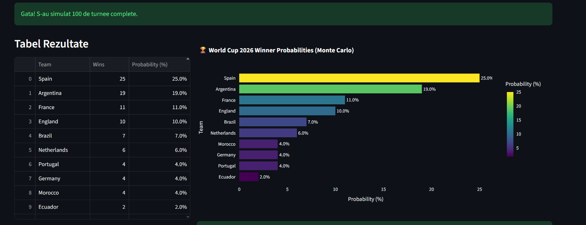
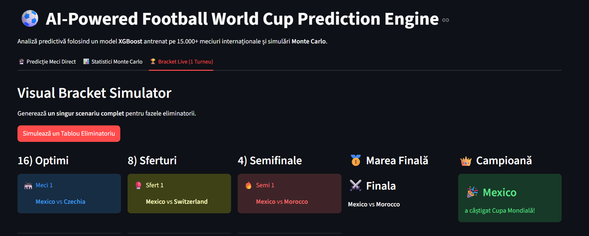

# ⚽ World Cup Prediction Engine (ML + Monte Carlo)

An AI-powered football prediction system that uses XGBoost, Elo ratings, and Monte Carlo simulations to estimate match outcomes and World Cup winners.

---

## 🚀 Features

- Predicts match outcomes using XGBoost
- Elo rating system for team strength
- Monte Carlo simulation of full tournaments
- Dynamic Streamlit dashboard
- Real-time match probability visualization

---

## 🧠 How it works

1. Historical match data is used to train an XGBoost model  
2. Teams are rated using an Elo system  
3. Match outcomes are predicted as probabilities (Home / Draw / Away)  
4. Monte Carlo simulation runs thousands of tournaments  
5. Final probabilities are computed from simulation results  

---

## 🛠️ Tech Stack

- Python  
- Pandas, NumPy  
- XGBoost (Machine Learning)  
- Streamlit (Web App)  
- Plotly (Visualization)  
- Docker (Deployment)
---

## 📊 Example Results





---

## ▶️ How to run

```bash
pip install -r requirements.txt
streamlit run app/streamlit_app.py

```
## 🚀 Quick Start (Docker)

```bash
docker build -t worldcup .
docker run -p 8501:8501 worldcup
```

# 📁 Project structure
```md
worldcup/
│── app/
│   └── streamlit_app.py      # Streamlit web interface (dashboard UI)
│── src/
│   ├── __init__.py
│   ├── predict.py            # ML inference pipeline
│   └── simulation.py         # Monte Carlo simulation engine & bracket logic
│── data/
│   └── raw/
│       └── teams_2026.csv    # Configuration of the 48 teams and official groups
│── models/
│   └── xgboost_model.json    # Trained and serialized model
│── README.md
```
## 💡 What makes this project special

This project combines:

- Machine Learning (XGBoost)
- Sports analytics (Elo ratings)
- Probabilistic simulation (Monte Carlo)
- Full interactive web UI (Streamlit)
  
## 🎯 Key Insight
The model does not predict a single winner — it estimates probabilities based on thousands of simulated tournament outcomes.
